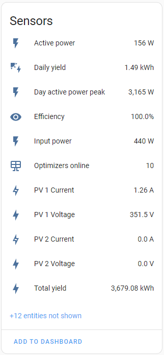
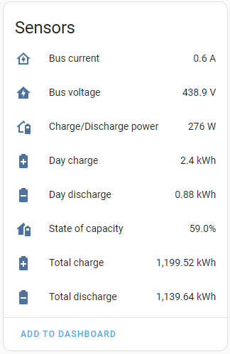
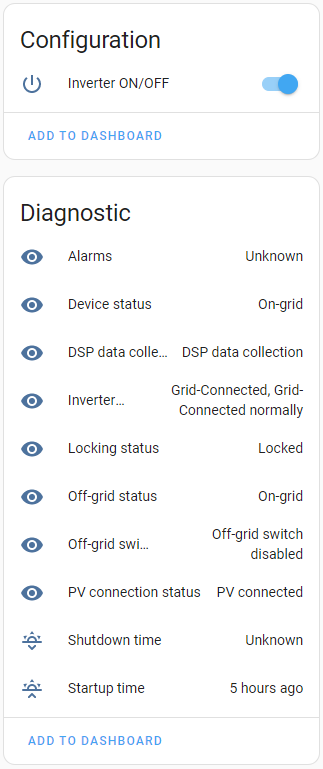
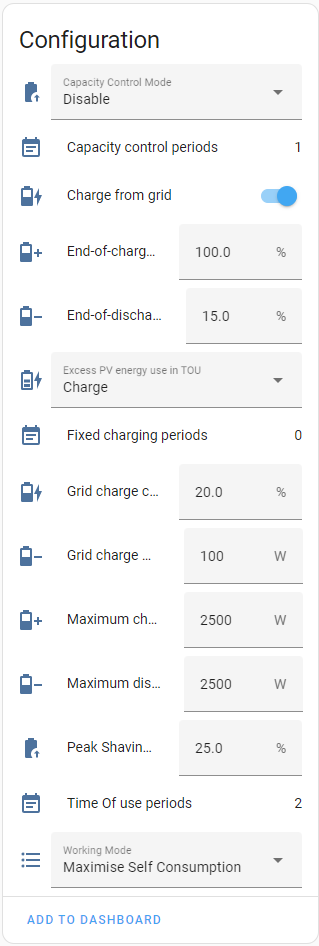
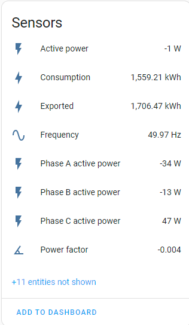
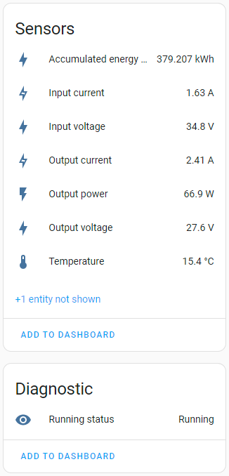
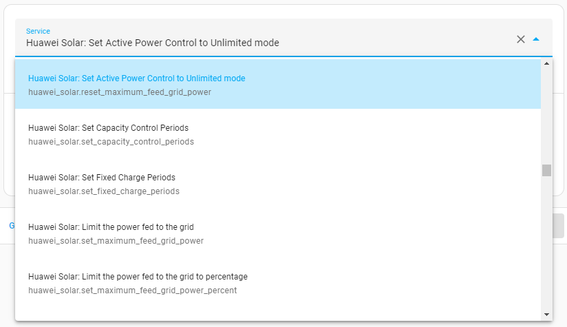

# Huawei Solar Integration

[](https://github.com/hacs/integration)
[](https://GitHub.com/wlcrs/huawei_solar/releases/)
[](https://github.com/wlcrs/huawei_solar/wiki)


> [!WARNING]
> Users that use the native modbus-integration alongside this integration should not upgrade to Home Assistant 2024.12.4, as it contains an upgrade to an incompatible version 3.7.4 of the pyModbus library. Significant work has already been done to upgrade this integration to support v3.8.0 of this library. We expect this to release alongside Home Assistant 2025.1, which is expected to also upgrade to that latest pyModbus version. This will solve the compatibility issue.


This integration exposes the information and functions made available by Huawei Solar inverters directly via one of its Modbus interfaces in Home Assistant.

## Table of Contents

- [Screenshots](#screenshots)
- [Prerequisites](#prerequisites)
- [Installation](#installation)
- [Inverter polling frequency](#inverter-polling-frequency)
- [FAQ - Troubleshooting](#faq---troubleshooting)

Looking for more information? The [Wiki](https://github.com/wlcrs/huawei_solar/wiki) contains in-depth documentation and support materials.
 
## Screenshots

| **Inverter**                                                           | **Battery**                                                  |
|:----------------------------------------------------------------------:|:------------------------------------------------------------:|
|                        |                |
|  |    |


|**Power Meter**                                          | **Optimizer**                                       |
|:-------------------------------------------------------:|:---------------------------------------------------:|
|   |   |


**HA Energy Dashboard**


**Services**

This integration exposes multiple services, allowing you to [actively control the amount of electricity exported to the grid](https://github.com/wlcrs/huawei_solar/wiki/Changing-Active-Power-Control) and [forcibly charge/discharge your battery](https://github.com/wlcrs/huawei_solar/wiki/Force-charge-discharge-battery).



To enable these advanced features, you need to select 'Elevate permissions' during the setup of this integration.

## Prerequisites

**Connection**

This integration supports two connection modes to SUN2000 inverters:
- direct serial connection to the RS485A1 and RS485B1 pins of the COM port
- network connection

Detailed information can be found on the ['Connecting to the inverter' Wiki-page](https://github.com/wlcrs/huawei_solar/wiki/Connecting-to-the-inverter)

**Firmware**

This integration supports inverters running firmware versions released in 2023 and later. Older firmware versions don't have support for all registers, which can result in the integration failing to work properly.

## Installation

1. Install this integration with HACS, or copy the contents of this
repository into the `custom_components/huawei_solar` directory
   [](https://my.home-assistant.io/redirect/hacs_repository/?owner=wlcrs&repository=huawei_solar&category=integration)
   
3. Restart HA
4. Start the configuration flow:
   - [](https://my.home-assistant.io/redirect/config_flow_start?domain=huawei_solar)
   - Or: Go to `Configuration` -> `Integrations` and click the `+ Add Integration`. Select `Huawei Solar` from the list

5. Choose whether you want to connect via serial or network connection


### Serial configuration

5. Select the "USB to RS485 converter" that you connected to the RS485A1 and RS485B1 pins of your inverter. The Slave ID should be identical to the *Com address* set in the *RS485_1* settings.


### Network configuration

5. Enter the IP address and port on which the Modbus-TCP interface is available. Some pointers:
   - The port is either `502` or `6607`.
   - When connecting to the inverter AP the host IP is typically `192.168.200.1` and the slave id is typically `0`.
   - When connecting to an SDongle, the slave id is typically `1`. Make sure to give this device a fixed IP!

   Checking the `Advanced: elevate permissions` checkbox will:
   - give you access to optimizer data
   - enable you to dynamically change your inverter and battery settings


6. When using the `elevate permissions` feature in combination with certain connection methods (most TCP-connections, not for serial connections),
   you will be asked to enter the credentials to the `installer` account in a next step. These are the
credentials used to connect to the inverter in the "Device Commissioning" section of
the FusionSolar App. The default password is either `00000a` or `0000000a`. If necessary, you can [perform a password reset](https://support.huawei.com/enterprise/en/doc/EDOC1100136173/8aa1f88a/resetting-password). This will not reset other parameters like the FusionSolar cloud connection or other changes made by the firm which did your solar installation.


## Inverter polling frequency

The integration will poll the inverter for new values every 30 seconds. If you wish to receive fresh inverter data less (or more) frequently, you can disable the automatic refresh in the integration's system options (Enable polling for updates) and create your own automations with your desired polling frequency. If your installation contains a power meter and/or battery, then you need to create a separate data polling automation for these devices. This allows for fine grained control of which entities must be updated more quickly.

```yaml
- alias: "Huawei Solar inverter data polling"
  trigger:
    - platform: time_pattern
      hours: "*"
      minutes: "*"
      seconds: "/20"
  action:
    - service: homeassistant.update_entity
      target:
        entity_id: sensor.inverter_daily_yield
- alias: "Huawei Solar power meter data polling"
  trigger:
    - platform: time_pattern
      hours: "*"
      minutes: "*"
      seconds: "/5"
  action:
    - service: homeassistant.update_entity
      target:
        entity_id: sensor.power_meter_active_power
- alias: "Huawei Solar battery data polling"
  trigger:
    - platform: time_pattern
      hours: "*"
      minutes: "*"
      seconds: "/20"
  action:
    - service: homeassistant.update_entity
      target:
        entity_id: sensor.battery_state_of_capacity
```

**Note:** optimizer data is refreshed only every 5 minutes, which matches how frequently the inverter refreshes this data. Increasing the update frequency of those entities will thus not result in a higher resolution.

## FAQ - Troubleshooting

**Q**: The Daily Yield/Total Yield is incorrect: it also goes up when the battery is discharging.

**A**: Huawei does not provide a Modbus register that represents the *output* of the inverter produced by energy coming only from the solar panels. It does provide a register that represents the *input* of the solar panels, but that does not take into account the conversion losses of the inverter. cfr. the Wiki page '[Daily Solar Yield](https://github.com/wlcrs/huawei_solar/wiki/Daily-Solar-Yield)' for some possible workarounds. cfr. [#1](https://github.com/wlcrs/huawei_solar/issues/1) for more context. 

---

**Q**: Why do I get the error "Connection succeeded, but failed to read from inverter." while setting up this integration?

**A**: While the integration was able to setup the initial connection to the Huawei Inverter, it did not respond to any queries in time. This is either caused by using an invalid slave ID (typically 0 or 1, try both or ask your installer if unsure), or because an other device established a connection with the inverter, causing the integration to lose it's connection

---

**Q**: Will the FusionSolar App still work when using this integration?

**A**: The inverter will still send it's data to the Huawei cloud, and you will still be able to see live statistics from your installation in the FusionSolar App. However, if you are using this integration via the network, and you (or your installer) need to use the 'Device commissioning' feature of the app, you will need to disable this integration.

---

**Q**: I want to connect multiple systems simultaniously to the Huawei Solar inverter. For example: 2 HA installations, EVCC, ...  Is this possible?

**A**: This integration connects to the inverter over Modbus. This protocol only supports one "server" (confusingly named, but this is the party sending queries to the inverter). It is therefore not possible to connect multiple systems directly to the inverter. However, you can use a [Modbus Proxy](https://github.com/Akulatraxas/ha-modbusproxy) to multiplex the connection to the inverter.

---

**Q**: How do I change the connection parameters (IP, port, USB device, installer password) of this integration?

**A**: Changing connection parameters is not supported. You need to delete the integration and install it again. You typically do not lose any history attached to your entities in Home Assistant.

---
<a name="daily-yield"></a>

**Q**: The "Daily Yield" value reported does not match with the value from FusionSolar?

**A**: The "Daily Yield" reported by the inverter is the *output* yield of the inverter, and not the *input* from your solar panels. It therefore includes the yield from discharging the battery, but misses the yield used to charge the battery. FusionSolar computes the "Yield" by combining the values from "Daily Yield", "Battery Day Charge" and "Battery Day Discharge". [More information on the Wiki ...](https://github.com/wlcrs/huawei_solar/wiki/Daily-Solar-Yield)

---

<a name="debugging"></a>

**Q**: I can't get this integration to work. What am I doing wrong?

**A**: First make sure that ['Modbus TCP' access is enabled in the settings of your inverter](https://forum.huawei.com/enterprise/en/modbus-tcp-guide/thread/789585-100027). Next, check if the port is correct. Some inverters use port 6607 instead of 502 (this can change for you after a firmware update!). If that doesn't work for you, and you intend to write an issue, make sure you have the relevant logs included. For this integration, you can enable all relevant logs by including the following lines in your `configuration.yaml`:

```yaml
logger:
  logs:
    pymodbus: debug # only include this if you're having connectivity issues
    huawei_solar: debug
    homeassistant.components.huawei_solar: debug
```

By providing logs directly when creating the issue, you will likely get help much faster.

---

<a name="enable-elevated-permissions"></a>

**Q**: I didn't check 'Advanced: Elevate permissions' during the initial setup of this integration and changed my mind. How do I change this?

**A**: Uninstall and reinstall this integration. You will not lose the history of your sensors.
