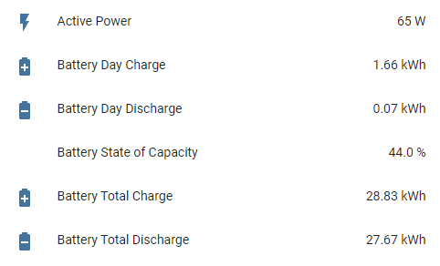
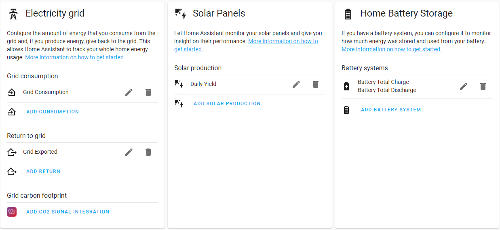
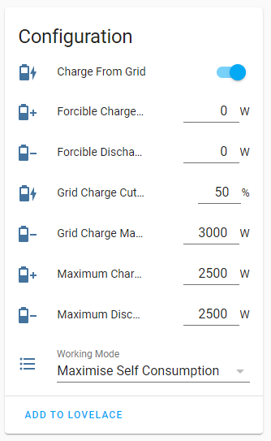
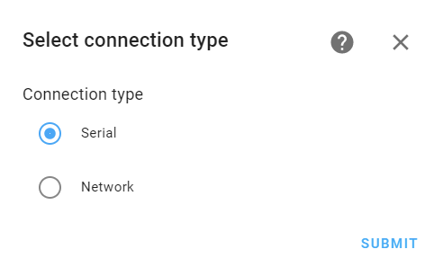
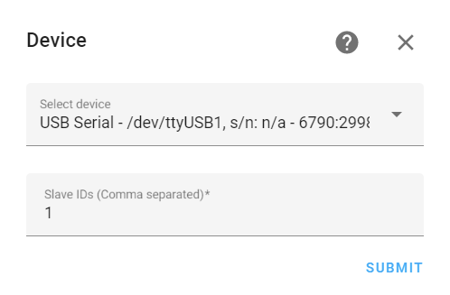
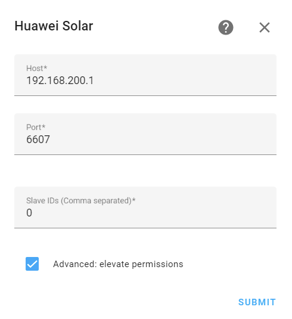

# Huawei Solar Integration

[](https://github.com/hacs/integration)
[](https://GitHub.com/wlcrs/huawei_solar/releases/)


This integration splits out the various values that are fetched from your
Huawei Solar inverter into separate HomeAssistant sensors. These are properly
configured  to allow immediate integration into the HA Energy view.






## Prerequisites

This integration supports two connection modes to SUN2000 inverters:
- direct serial connection to the RS485A1 and RS485B1 pins of the COM port 
- network connection

Detailed information can be found on the ['Connecting to the inverter' Wiki-page](https://github.com/wlcrs/huawei_solar/wiki/Connecting-to-the-inverter)

## Installation

1. Install this integration with HACS, or copy the contents of this
repository into the `custom_components/huawei_solar` directory
2. Restart HA
3. Start the configuration flow:
   - [](https://my.home-assistant.io/redirect/config_flow_start?domain=huawei_solar)
   - Or: Go to `Configuration` -> `Integrations` and click the `+ Add Integration`. Select `Huawei Solar` from the list

4. Choose whether you want to connect via serial or network connection





### Serial configuration

5. Select the "USB to RS485 converter" that you connected to the RS485A1 and RS485B1 pins of your inverter. The Slave ID should be identical to the *Com address* set in the *RS485_1* settings.



### Network configuration

5. Enter the IP address and port on which the Modbus-TCP interface is available (when connecting to the inverter AP the host IP is typically `192.168.200.1` and the port is either `502` or `6607`). The slave id is typically `0`. You should only check the `Advanced: elevate permissions` checkbox if you intend to dynamically change your battery settings or want access to the optimizer data.



6. When using the `elevate permissions` feature, you will be asked to enter
the credentials to the `installer` account in a next step. These are the
credentials used to connect to the inverter in the "Device Commissioning" section of
the FusionSolar App. The default password is `00000a`.


## Inverter polling frequency

The integration will poll the inverter for new values every 30 seconds. If you wish to receive fresh inverter data less (or more) frequently, you can disable the automatic refresh in the integration's system options (Enable polling for updates) and create your own automation with your desired polling frequency.

```yaml
- alias: "Huawei Solar inverter data polling"
  trigger:
    - platform: time_pattern
      hours: "*"
      minutes: "*"
      seconds: "/10"
  action:
    - service: homeassistant.update_entity
      target:
        entity_id: sensor.daily_yield
```

Note that optimizer data is refreshed only every 5 minutes, which matches how frequently the inverter refreshes this data.

## FAQ - Troubleshooting

**Q**: Why do I get the error "Connection succeeded, but failed to read from inverter." while setting up this integration?

**A**: While the integration was able to setup the initial connection to the Huawei Inverter, it did not respond to any queries in time. This is either caused by using an invalid slave ID (typically 0 or 1, try both or ask your installer if unsure), or because an other device established a connection with the inverter, causing the integration to lose it's connection

---

**Q**: Will the FusionSolar App still work when using this integration?

**A**: The inverter will still send it's data to the Huawei cloud, and you will still be able to see live statistics from your installation in the FusionSolar App. However, if you are using this integration via the network, and you (or your installer) need to use the 'Device commissioning' feature of the app, you will need to disable this integration.

---

<a name="daily-yield"></a>

**Q**: The "Daily Yield" value reported does not match with the value from FusionSolar?

**A**: The "Daily Yield" reported by the inverter is the *output* yield of the inverter, and not the *input* from your solar panels. It therefore includes the yield from discharging the battery, but misses the yield used to charge the battery. FusionSolar computes the "Yield" by combining the values from "Daily Yield", "Battery Day Charge" and "Battery Day Discharge". [More information on the Wiki ...](https://github.com/wlcrs/huawei_solar/wiki/Daily-Solar-Yield)

---

<a name="debugging"></a>

**Q**: I can't get this integration to work. What am I doing wrong?

**A**: First make sure that ['Modbus TCP' access is enabled in the settings of your inverter](https://forum.huawei.com/enterprise/en/modbus-tcp-guide/thread/789585-100027). Next, check if the port is correct. Some inverters use port 6607 instead of 502 (this can change for you after a firmware update!). If that doesn't work for you, and you intend to write an issue, make sure you have the relevant logs included. For this integration, you can enable all relevant logs by including the following lines in your `configuration.yaml`:

```yaml
logger:
  logs:
    pymodbus: debug # only include this if you're having connectivity issues
    huawei_solar: debug
    homeassistant.components.huawei_solar: debug
```

By providing logs directly when creating the issue, you will likely get help much faster.
