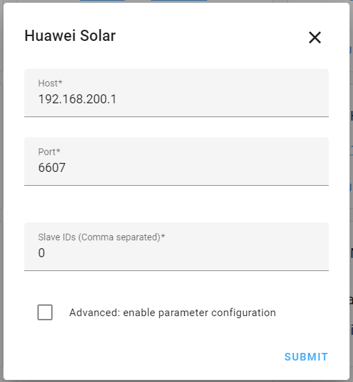

# Huawei Solar Integration

[](https://github.com/custom-components/hacs)
[](https://GitHub.com/wlcrs/huawei_solar/releases/)


This integration splits out the various values that are fetched from your
Huawei Solar inverter into separate HomeAssistant sensors. These are properly
configured  to allow immediate integration into the HA Energy view.


## Installation

1.  [Connect Home Assistant to the WiFi Access Point of your Huawei inverter.](https://github.com/wlcrs/huawei_solar/wiki/Connecting-to-the-inverter#getting-connectivity-between-ha-on-your-home-network-and-the-inverter-ap)
1. Install this integration with HACS, or copy the contents of this
repository into the `custom_components/huawei_solar` directory
1. Restart HA
1. Start the configuration flow:
   - [](https://my.home-assistant.io/redirect/config_flow_start?domain=huawei_solar)
   - Or: Go to `Configuration` -> `Integrations` and click the `+ Add Integration`. Select `Huawei Solar` from the list

4. Enter the IP address of your inverter (192.168.200.1). The slave id is typically 0. You should only check the `Advanced: enable parameter configuration` checkbox if you intend to dynamically change your battery settings.



5. When using the `parameter configuration` feature, you might be asked to enter
the credentials to the `installer` account in a next step. These are the 
credentials used to connect to the inverter in the "Device Commissioning" section of
the FusionSolar App.

## What IP-address and port should I enter?

Starting from firmware updates released in December 2021, Huawei has closed the Modbus-TCP interface on the network to which the inverter connects. ie. If the inverter is connected to your home network on `192.168.1.11`, it will no longer be possible to connect on that IP.  This also applies for connecting via the Dongle.  You will need to connect to the inverter using the WiFi AP.

To configure your WiFi access, connect to the WiFi SSID `SUN2000-<inverter serial number>`, and use the Modbus-TCP interface available on `192.168.200.1`. In most cases, the port has been moved to `6607` instead of `502`.


### How do I connect to the inverter WiFi?
There are multiple possible approaches which are discussed on our [Connecting to the inverter Wiki-page](https://github.com/wlcrs/huawei_solar/wiki/Connecting-to-the-inverter#getting-connectivity-between-ha-on-your-home-network-and-the-inverter-ap)

## SDongle Configuration

If your inverter has an SDongle, you need to make sure that it is properly configured to access it via your home network. 
Use the 'Device Commissioning' function of the FusionSolar app to login on your inverter (default password for the 'installer' account is '00000a').
In Settings > Communication Configuration:
- Set "Dongle Parameter Settings" → "Modbus TCP" → "Connection" to "Enabled (Unrestricted)"
- Set "Parallel system communication parameter setting" → "Parallel communication mode" to "RS485"

Note: Having an SDOngle will not remove the requirement of connecting to the WiFi AP of the inverter.

## Inverter polling frequency

The integration will poll the inverter for new values every 30 seconds. If you wish to receive fresh inverter data less (or more) frequently, you can disable the automatic refresh in the integration's system options (Enable polling for updates) and create your own automation with your desired polling frequency.

```yaml
- alias: "Huawei Solar inverter data polling"
  trigger:
    - platform: time_pattern
      hours: "*"
      minutes: "*"
      seconds: "/10"
  action:
    - service: homeassistant.update_entity
      target:
        entity_id: sensor.daily_yield
```

## FAQ - Troubleshooting

**Q**: Why do I get the error "Connection succeeded, but failed to read from inverter." while setting up this integration?

**A**: While the integration was able to setup the initial connection to the Huawei Inverter, it did not respond to any queries in time. This is either caused by using an invalid slave ID (typically 0 or 1, try both or ask your installer if unsure), or because an other device established a connection with the inverter, causing the integration to lose it's connection

---

**Q**: Will the FusionSolar App still work when using this integration?

**A**: The inverter will still send it's data to the Huawei cloud, and you will still be able to see live statistics from your installation in the FusionSolar App. However, if you (or your installer) need to use the 'Device commissioning' feature of the app, you will need to disable this integration. Only one of them can be connected to the inverter at any one time.

---

<a name="daily-yield"></a>

**Q**: The "Daily Yield" value reported does not match with the value from FusionSolar?

**A**: The "Daily Yield" reported by the inverter is the *output* yield of the inverter, and not the *input* from your solar panels. It therefore includes the yield from discharging the battery, but misses the yield used to charge the battery. FusionSolar computes the "Yield" by combining the values from "Daily Yield", "Battery Day Charge" and "Battery Day Discharge". [More information on the Wiki ...](https://github.com/wlcrs/huawei_solar/wiki/Daily-Solar-Yield)

---

<a name="debugging"></a>

**Q**: I can't get this integration to work. What am I doing wrong?

**A**: First make sure that ['Modbus TCP' access is enabled in the settings of your inverter](https://forum.huawei.com/enterprise/en/modbus-tcp-guide/thread/789585-100027). Next, check if the port is correct. Some inverters use port 6607 instead of 502 (this can change for you after a firmware update!). If that doesn't work for you, and you intend to write an issue, make sure you have the relevant logs included. For this integration, you can enable all relevant logs by including the following lines in your `configuration.yaml`:

```yaml
logger:
  logs:
    pymodbus: debug # only include this if you're having connectivity issues
    huawei_solar: debug
    homeassistant.components.huawei_solar: debug
```

By providing logs directly when creating the issue, you will likely get help much faster.
